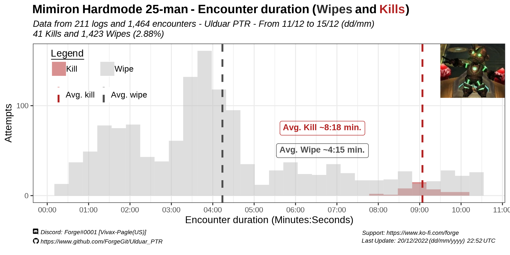
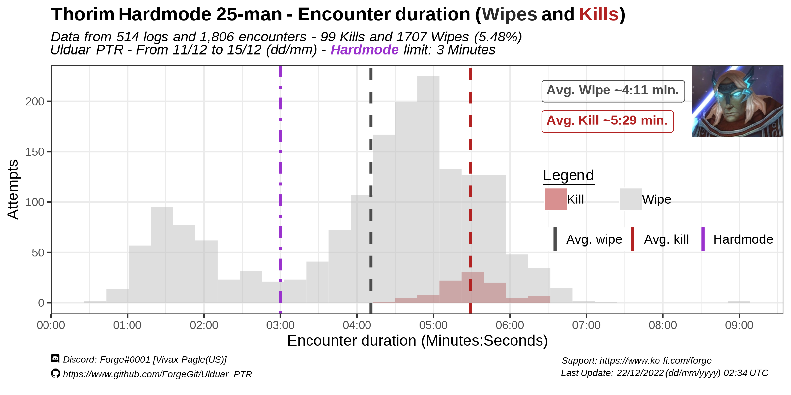
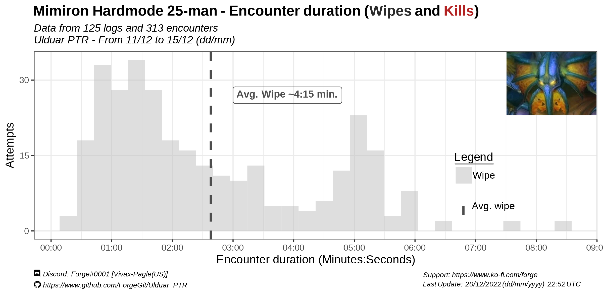
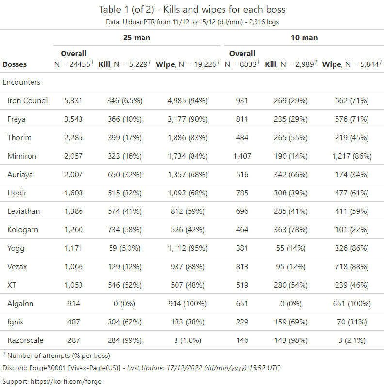
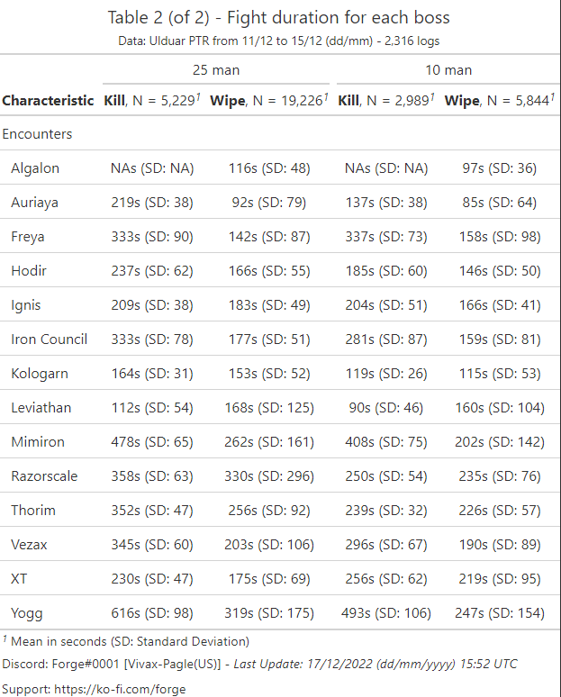
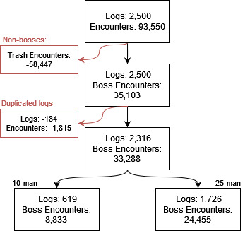

# Ulduar PTR Data

MORE Text will go here eventually. Or maybe no idk.

As of 06/01/2023 (dd/mm/yyyy) there is a new PTR build and the raid has been open again. I am currently working on processing the new data/logs from Ulduar PTR "version 2" and expect to have it done by tuesday-wednesday  10th-11th.

The main purpose of this data is to:

(1) Identify which parts of each boss encounter raids were having the most trouble with.

(2) Obtain a rough estimate of kill times.

Based on the bias the data has (coming from PTR) it would be bold to assume the kill:wipe rates in PTR will be the same in live servers once Ulduar goes out. You can check more details regarding the "limitations" of this data at the bottom.

# Table of Contents
1. [Hardmodes](#hardmodes-wipes-and-kills-)  
        1.2. [Iron Council HM](#iron-council-hm-) 
        1.3. [Freya HM](#freya-hm-) 
        1.4. [Hodir](#hodir-) 
        1.5. [Mimiron HM](#mimiron-hm-) 
        1.6. [Thorim HM](#thorim-hm-) 
        1.7. [General Vezax HM](#general-vezax-hm-) 
        1.8. [Algalon](#algalon-) 
        1.9. [Yogg-0](#yogg-0-) 
2. [Overrall Tables](#overall-tables---boss-encounters-) 
3. [Methodology](#methodology-) 
        3.1 [HM Classification](#hardmode-classification-) 
        3.2 [Limitations](#limitations-) 
        3.3 [Other Comments Received](#other-comments-received-) 

## Hardmodes Wipes and Kills 

### Iron Council HM 

Most of the wipes happen close to the dead of the 2nd add (right before or right after). Likely related to tanks (not) surviving Steelbreaker Fusion Punch or increased damage of Phase 3 in general.

  
 
  
  
  

### Freya HM 

Wipes happen mostly early in the fight, during the first 3 sets of adds spawning.

  
  
  
  
  

### Hodir 

Lots of wipes right after the 2 minutes mark (required for it to be "hardmode"). Likely intentional, but very few were able to make it.

 

### Mimiron HM 

 
  
  
  
  

### Thorim HM 

 
 
### General Vezax HM 

 
 
### Algalon 

 
 
### Yogg-0 

Wipes on phase 1, 2 and 3

 
 Less than 1% of attempts on Yogg-0 resulted in a kill.
 

## Overall Tables - Boss Encounters 

DISCLAIMER: Data in the following tables are for BOTH hardmodes AND normal modes.For now.
Blame Blizzard/WCL

Tables originally posted (by me) in this reddit post:
https://www.reddit.com/r/classicwow/comments/zob655/5_of_yogg_25m_attempts_were_a_kill_ulduar_ptr/

 
 

## Methodology 

More text will go here - LIMITATIONS OF THE DATA CAN BE FOUND BELOW!

All the data was collected using the WCL API v2 and processed with R v.4.1 (R Development Core Team).

Ulduar raids were located in this zone: https://classic.warcraftlogs.com/zone/reports?zone=1017

Ideally this repository should eventually have both the aggregated data used and all the code made to generate both the tables and the graphics.

### Hardmode classification 

At the moment of this analysis being done, there is no "Hardmode/Normal" category for Ulduar Bosses data. 

In order to classify a wipe or kill as "hardmode" the following criteria was used:

* Iron Council: 
    * "Steelbreaker" has to be alive (no death for "Steelbreaker" in the logs)
    * "Steelbreaker" has to die 3rd (after both "Runemaster Molgeim" and "Stormcaller Brundir" have died, doesn't matter the order of these 2).

- Freya: Any attempt were Freya had either [Brightleaf's Essence](https://www.wowhead.com/wotlk/spell=62385)
 (ability.id = 62385) or [Stonebark's Essence](https://www.wowhead.com/wotlk/spell=62386)  (ability.id = 62386) was considered a "HM" attempt.

- Hodir: All attempts are presented in the graphics, since the only condition for it to be "HM" is killing Hodir sub 2 minutes.

- Mimiron:
    - The [Emergency Mode](https://www.wowhead.com/wotlk/spell=64582) (ability.id = 64582) buff is present on enemies (only detectable in P2 onwards).
    - Damage from [Flames](https://www.wowhead.com/wotlk/spell=64566) (ability.id = 64566) is present on friendlies (detectable if someone gets hit by it, which is almost always at least 1 person. If you aren't getting hit by Flames, you are likely making it to P2 therefore being detected through Emergency Mode)
            
- Thorim:
    - The wipe happens before 3 minutes
    - Thorim does NOT gain the buff [Touch of Dominion](https://www.wowhead.com/wotlk/spell=62565) (ability.id = 62565), which he can only get it if he loses [Touch of Dominion](https://www.wowhead.com/wotlk/spell=62507) (ability.id = 62507) after 3 minutes have passed.
            
- General Vezax: Friendlies have NOT received damage from [Saronite Vapors](https://www.wowhead.com/wotlk/spell=63338) (ability.id = 63338)

- Yogg-0: None of the following buffs can be present on friendlie units:
    - [Speed of Invention](https://www.wowhead.com/wotlk/spell=62671) (ability.id = 62671)
    - [Resilience of Nature](https://www.wowhead.com/wotlk/spell=62670) (ability.id = 62670) 
    - [Fury of the Storm](https://www.wowhead.com/wotlk/spell=62702) (ability.id = 62702) 
    - [Fortitude of Frost](https://www.wowhead.com/wotlk/spell=62650) (ability.id = 62650)

### LIMITATIONS 

a.k.a. Things to consider when interpreting this as "information"

- Not all logs are public. Given it is on the interest of some guilds to make their logs private on PTR due to the competitive nature of "progression" rewards (lumberjack rankings, in-game title, larping), this statistics are more biased towards a more casual playerbase. (I.E. less kills, more wipes, longer kill times).

- Not everyone has logs of their runs. Probably a minority, if you think most players are in a somewhat well-informed communities. Or it could be a great majority of players not logging their runs if you think most of the playerbase is "casual" and doesn't care about logging.

- PTR  means a portion of the players have either incomplete or scuffed UIs/macros/addons, making the overrall performance of the average player worse than what it actually is in live servers. Another group of the PTR players could also be testing specs and gear.

- Raids in general are mostly testing the content, sometimes wiping on purpose or doing quick pulls "just to see the boss". 

### other comments 

For the Throrim HM graphic, user [u/Cephell](https://www.reddit.com/r/classicwow/comments/zuj635/comment/j1kpign/) pointed out that the average time for wipes is meaningless since it shows a multi-modal distribution.

This is correct and that measurement interpretation would end up being a wild guess. In order to more accurately represent the time it takes to wipe on a real hardmode attempt, only wipes that have happened after P1 should be considered (i.e. if you didn't made it past the tunnel, you really had no chance anyways at a hardmode attempt).

