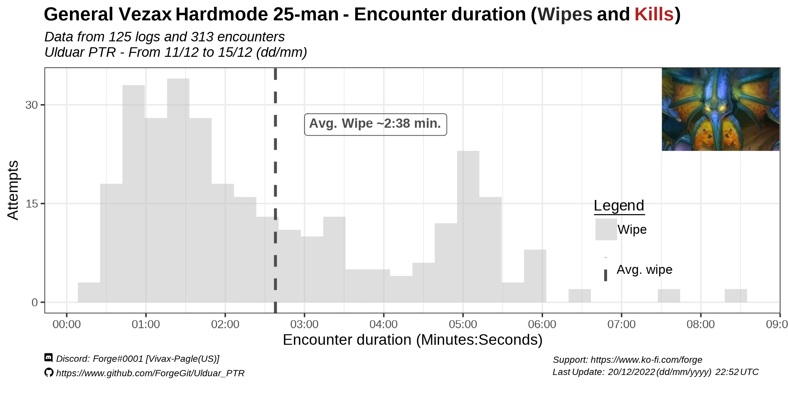

# Ulduar PTR Data

MORE Text will go here eventually.

The main purpose of this data is to:

(1) Identify which parts of each boss encounter raids are having the most trouble with.

(2) Obtain a rough estimate of kill times.

Based on the bias the data has (coming from PTR) it would be bold to assume the kill:wipe rates in PTR will be the same in live servers once Ulduar goes out. You can check more details regarding the "limitations" of this data at the bottom.

# Table of Contents
1. [Hardmodes](##Hardmodes Wipes and Kills)
  1.2. [Iron Council HM](### Iron Council HM)
  1.3. [Freya HM](### Freya HM)
  1.4. [Hodir](### Hodir)
  1.5. [Mimiron HM](### Mimiron HM)
  1.6. [General Vezax HM](### General Vezax HM)
  1.7. [Algalon](### Algalon)
  1.8. [Algalon](### Yogg-0)
2. [Overrall Tables](## Overall Tables - Boss Encounters)
3. [Methodology](## Methodology)
  3.1 [Limitations](### Limitations)

## Hardmodes Wipes and Kills

### Iron Council HM

Most of the wipes happen close to the dead of the 2nd add (right before or right after). Likely related to tanks (not) surviving Steelbreaker Fusion Punch or increased damage of Phase 3 in general.

  
 
  
  
  

### Freya HM

Wipes happen mostly early in the fight, during the first 3 sets of adds spawning.

  
  
  
  
  

### Hodir 

Lots of wipes right after the 2 minutes mark (required for it to be "hardmode"). Likely intentional, but very few were able to make it.

 

### Mimiron HM 

 
  
  
  
  

### General Vezax HM 

 
 
### Algalon

 
 
### Yogg-0

Wipes on phase 1, 2 and 3

 
 Less than 1% of attempts on Yogg-0 resulted in a kill.
 

## Overall Tables - Boss Encounters

DISCLAIMER: Data in the following tables are for BOTH hardmodes AND normal modes.For now.
Blame Blizzard/WCL

Tables originally posted (by me) in this reddit post:
https://www.reddit.com/r/classicwow/comments/zob655/5_of_yogg_25m_attempts_were_a_kill_ulduar_ptr/

 
 

## Methodology

More text will go here

All the data was collected using the WCL API and processed with R v.4.1 (R Development Core Team).

Ideally this repository should eventually have both the raw data used and all the code used to generate both the tables and the graphics.

### LIMITATIONS

a.k.a. Things to consider when interpreting this as "information"

- Not all logs are public. Given it is on the interest of some guilds to make their logs private on PTR due to the competitive nature of "progression" rewards (lumberjack rankings, in-game title, larping), this statistics are more biased towards a more casual playerbase. (I.E. less kills, more wipes, longer kill times).

- Not everyone has logs of their runs. Probably a minority, if you think most players are in a somewhat well-informed communities. Or it could be a great majority of players not logging their runs if you think most of the playerbase is "casual" and doesn't care about logging.

- PTR  means a portion of the players have either incomplete or scuffed UIs/macros/addons, making the overrall performance of the average player worse than what it actually is in live servers. Another group of the PTR players could also be testing specs and gear.

